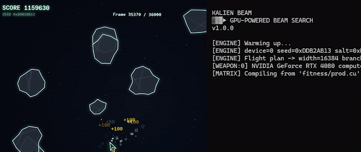

[](https://github.com/FredericRezeau/kalien-beam/actions/workflows/build.yml)
[](/LICENSE)



# kalien-beam

If you want to grind KALIEN **by the million per tape**, `kalien-beam` aims your GPU deep into the asteroid belt and lets the beam search rip. No wasted shots.

**kalien-beam** is a C++/CUDA-beam search engine built for [kalien.xyz](https://kalien.xyz), a remake of the 1979 Atari classic Asteroids, warp-powered by ZK proofs on Stellar. The engine also supports **pure CPU** builds.

---
My current high score: **1,192,340**. You may need a bit of [seed hunting](#seed-hunting) to beat it, but if you do let me know ^^  
[Tape Replay](https://kalien.xyz/replay/ede26512-00e8-4696-9c24-f814520e082c) · [ZK Proof](https://explorer.boundless.network/orders/0xf2edcf1388a286801f23ed8ac67b699c57ec97a5dd6e6899) · [Stellar Transaction](https://stellar.expert/explorer/public/tx/1c233ad26e414ce44c195f61a3885d4c99cd8b454b75aa4a285534c776083d2f)

---
Read the full write-up on my blog: [The One Million KALIEN Tape](https://kyungj.in/posts/million-kalien-tape-stellar-zk-gaming/)

## Performance

### GPU

_Ran with `--seed 0xDDB2AB13` on an NVIDIA RTX 4080._  
VRAM usage ≈ `width × branches × 1,372 bytes` (`sizeof(Simulation) = 1,372`)

| Width | Branches | Horizon | VRAM | Beam-Steps/s | Avg Round | Score |
|-------|----------|---------|------|-------------|-----------|-------|
| 16,384 | 8 | 20 | ~206 MB | 412.5B/s | 6.35ms | 1,008,610 |

GPU kernel time was 11.4s, while total wall time was ~161s (~2m40s), still well within a single seed epoch for consistent >1M submissions.

### CPU

_Ran with `--seed 0x7A9005B7` on an Intel Core i9-14900K (24 cores, 32 threads)._

| Width | Branches | Horizon | Threads | Wall Time | Score |
|-------|----------|---------|---------|-----------|-------|
| 16,384 | 8 | 20 | 32 | ~2m | 1,012,180 |

CPU mode parallelises across all available cores via `std::thread` by default. On a modern multi-core machine it runs at comparable wall time to GPU for the default parameters.

## Build

### GPU build

**Requirements:**
- NVIDIA GPU (sm_75 / Turing or newer recommended)
- CUDA Toolkit 12.x (with `nvcc` and `nvrtc`)
- C++17 compiler: `g++` (Linux/macOS) or MSVC (Windows)

```bash
make
```

### CPU build

**Requirements:**
- C++17 compiler: `g++` (Linux/macOS) or MSVC (Windows)

```bash
make CPU=1
```

The CPU binary is fully self-contained (no CUDA, NVRTC, drivers).

## Usage

```
./kalien --seed <hex> --out <path> [options]
```

GPU architecture is auto-detected via `nvidia-smi`. Falls back to `sm_75` if detection fails.

### Required

| Flag | Description |
|------|-------------|
| `--seed <hex\|dec>` | Kalien contract seed |
| `--out <path>` | Output tape base path (suffix `_<salt>_<score>.tape` is appended) |

### Options

| Flag | Default | Description |
|------|---------|-------------|
| `--beam <n>` | 16384 | Beam width |
| `--branches <n>` | 8 | Branches explored (1–8) |
| `--horizon <n>` | 20 | Lookahead depth in frames |
| `--frames <n>` | 36000 | Total simulation frames |
| `--wave <n>` | 7 | Lurk mode activation threshold (0 = disable) |
| `--salt <hex\|dec>` | 0 | Salt value |
| `--iterations <n>` | 1 | Number of runs (increments salt each time) |
| `--fitness <path>` | built-in | _(GPU only)_ CUDA source file (.cu) for custom fitness function (JIT NVRTC compiled) |
| `--device <n>` | 0 | _(GPU only)_ GPU device index |
| `--threads <n>` | 0 | _(CPU only)_ Number of threads (0 = max) |

### Examples

```bash
./kalien --seed 0xDDB2AB13 --out tapes/single
```

## Auto Pilot Script

`run.sh` automates the full loop: fetches the current seed, runs the beam search, submits tapes live as scores improve, then waits for the next seed.

**Requirements:** `bash`, `curl`, `python3`

```bash
# Example: run continuously with salt 100, submit automatically
./run.sh YOUR...ADDRESS --dir runs --salt 100
```

### Options

| Flag | Default | Description |
|------|---------|-------------|
| `--dir <path>` | `.` | Output directory for tapes/logs |
| `--jobs <n>` | `1` | Max concurrent jobs |
| `--salt <hex>` | `0x1` | Starting salt |
| `--nosubmit` | off | Run without submitting |
| `--process-name <name>` | `./kalien` | Path to kalien binary |

## Custom Fitness

_(GPU builds only)_

Fitness functions are compiled at runtime (JIT) using NVRTC. Write a `.cu` file implementing:

```cpp
__device__ __forceinline__ float fitness(const Simulation& sim, int32_t wave);
```

Then pass it with `--fitness your_fitness.cu`. See `fitness/default.cu` for the default implementation. The built-in heuristic is also embedded in `fitness.cuh`.

## Seed Hunting

Pass `--iterations N` with `--salt` to sweep across salt values. Each iteration perturbs beam fitness with a deterministic xorshift noise derived from the salt. Output files are named `<base>_<salt>_<score>.tape` and the best score across all iterations is saved *live* so you can submit tapes as they land (while the program keeps running).

```bash
# Seed hunt across 100 salts starting from 0xD1
./kalien --seed 0xDDB2AB13 --out tapes/hunt --salt 0xD1 --iterations 100
```

### Expected Ceiling

- Avg pts/kill: **911** (90% small saucer × 990 + 10% large × 200)
- Avg spawn cycle: **~70 frames** (60-frame wait + 10-frame cooldown)
- 3 concurrent saucers → **~39.04 pts/frame** expected rate

Perfect execution with average RNG gives a theoretical ceiling at **~1,289,000**. Exceeding ~1,398,000 may be possible with heavy seed hunting for favorable RNG.

## Disclaimer

This software is experimental and provided "as-is," without warranties or guarantees of any kind. Use it at your own risk.

## License

[MIT License](LICENSE)


